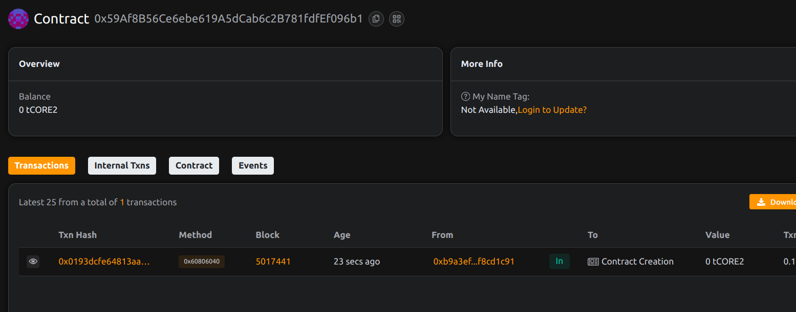

# Project Title: ArtChance: Generative NFT Lottery System

## Project Description

ArtChance is a decentralized lottery where participants buy tickets to win a unique generative NFT artwork. A single winner is randomly selected each round to receive a special NFT, minted and assigned dynamically.
  
## Project Vision      

To gamify NFT distribution by combining on-chain randomness with artistically generated digital assets, encouraging community engagement through fair chance mechanics.

## Key Features

- NFT lottery rounds with buy-in ticketing
- On-chain random winner selection (pseudo-random for MVP)
- Customizable token URI per round for generative art     
- Admin-controlled round lifecycle

## Future Scope

- Integrate Chainlink VRF for provable randomness
- Community-governed art pool and prize themes
- Multi-winner support and rare prize tiers
- Bridging to off-chain generative art engines
project done by piyush bohra
## Contract Details
0x59Af8B56Ce6ebe619A5dCab6c2B781fdfEf096b1

